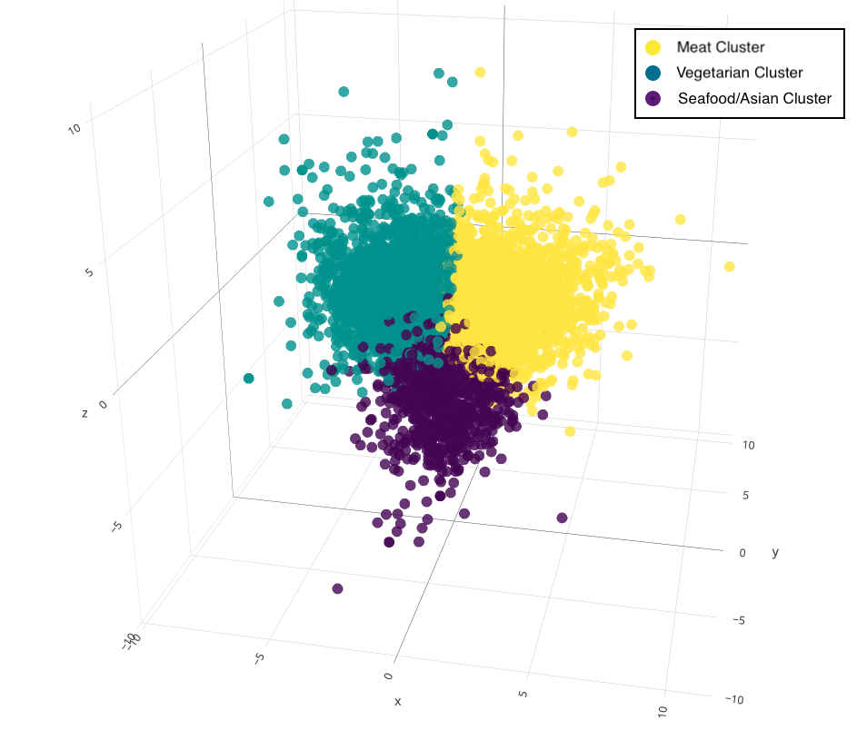

# Smunch Customer Clustering and Meal Satisfaction Analysis

## Table of Contents
1. [Background](#background)
2. [Motivation](#motivation)
3. [Goals](#goals)
4. [Difficulties](#difficulties)
5. [Structure](#structure)
  1. [Clustering](#clustering)
    1. [Data](#clust_data)
    2. [First Run Findinngs](#clust_run1)
    3. [Second Run Findings](#clust_run2)
    4. [Dimensionality Reduction](#dim_reduc)
    5. [Cluster Breakdown](#clust_break)
    6. [Radar Plots](#clust_radar)
  2. [Probability of Meal Prediction](#mealp)
    1. [Background](#mealp_back)
    2. [Model](#mealp_model)
  3. [Meal Rating Prediction](#mealr)
    1. [Data](#mealr_data)
    2. [Models and Performance](#mealr_mandp)
    3. [Issue and Solution](#mealr_iands)
  4. [Recommender](#recommender)

<a name="background"/>

## Background:
Smunch is a rapidly growing B2B Food Delivery service based out of Germany, with their headquarters in Berlin. The general structure of Smunch consists of allowing employees of subscribing companies to choose an offered meal from local restaurants which Smuch packages and deliverers to the company. The number of options per day varies but is normally 4 or 8 depending on the subscribing company. If eight options per day they are from two restaurants with four options each. Each day the menu is changed and eight new meals are offered.

## Motivation:
As Smunch continues to expand and increase volume, it is extremely important to understand the trends and habits of their growing customer base. From a basic understanding of what meals are popular to an in-depth breakdown of what the key ingredients in meals, certain customers find most important, understanding what makes Smunch customers tick will allow Smunch to continuously improve their product and customer experience. More concretely having insights into key ingredients will allow Smunch to tailor meals to appeal to a wider customer base as well as increased order numbers. Understanding the factions or clusters of their customers and what they like will allow them to make sure each customer is presented with a good meal option every day. Other insights including identifying which customers are the most loyal and which customers churn or will allow for tailored efforts to increase customer retention and frequency of use.

## Goals :
Bellow are the desired outcomes of the Smunch Customer and Meal Analysis:

- Clustering of customers based on ingredient preferences:
  - Motivation:
    - Customize menu so that each cluster of customers has a food option each day.
    - Understand what their largest customer base cares about and what features of meals are only liked by a small portion of the entire customer base.
- Identification of key ingredients in customer meal choice:
  - Motivation:
    - Allow Smunch to avoid negatively contributing ingredients to meals.
    - Work with restaurants to create other promising meals.
- Predict overall successfulness of meal compared to other offered meals based on ingredients:
   - Motivation:
    - Allow Smunch to compare different meal offering combinations to:
        1. See how well meals will performed compared to others.
        2. Make sure all user groups are given a decent meal choice.

## Potential Areas of Concern / Difficulty:
#### 1. Lack of a strong signal in individual ingredient importance. Meals are complex and the interaction of ingredients is what really makes up the taste. Individual ingredients might not encompass these complex relations.
#### 2. Comparing users who have been using Smunch for a long time vs recently started using Smunch:
  - Handling meals that have never been offered to a user.
  - Handling situations where meals have not been offered at the same time as other meals.
#### 3. Data Wrangling:
  - Large database with lots of connected tables could mean lots of time getting queries correct and performing analysis on the data.
#### 4. Unsupervised Learning:
  - Clustering users into groups might be hard to correctly identify or label the clusters
  - What to set the limit on the number of clusters to etc.

# Structure:
## Clustering:
  - This folder attempts to clusters users based on their ingredient preferences.

### How Clustering Was Performed:

1. Data:
 
| UserID | Ingredient 1 Freq | Ingredient 2 Freq | ... | Ingredient N Freq |
|--------|-------------------|-------------------|-----|-------------------|
| 1      | .2                | .8                |     | .35               |
| 2      | .5                | .3                |     | .6                |

  - Ingredient Frequency Definition:
    - Number of Times Ingredient is Present in Ordered Meals / Total Number of Ordered Meals
    
2. Models:
  - Kmeans
  - Hierarchical Cluster
  
### First Run Insight:
Because there are 1400+ unique ingredients many ingredients that are very similar are counted as seperate and skew the clustering to favor various forms of spices and vegetables as the most important feature for all clusters. To fix this I manually went through the 900 top ingredients and mapped them to 89 unique ingredient categories. This helped several aspects of the clustering:
  1. Greatly lowered the dimensionality and allows for much faster computation time on generating the clusters.
  2. Key ingredients in dish (or the ingredient that make up the bulk of the dish), for example chicken, fish, avocado, pasta, are actually the most important features in each cluster.
  3. Categories allow for much more meaningful insight into what each cluster prefers. The extremely specific ingredients are hard to gain meaning from.
Ingredient frequency also was standardized so that ingredients that all ingredients have the same weighting.
  
### Second Run Results (With Ingredient Categories):
With ingredient categories Kmeans clustering cann identify some clear user groups. The below silhouette score plot shows how well seperated different cluster sizes are.

Based on this plot and inspection of clusters, 3 and 5 are the most insightful numbers.

### Dimensionality Reduction using PCA and tSNE (For Plotting Purposes)
To get a sense of how these clusters are forming we can use PCA or tSNE to lower the dimensionality of the features to 2 or 3 dimensions.
 - PCA Results: The amount of variance accounted for by x number of principal components is as follows:

Using the first three principal compenents and plotting a subset of the user clusters, we get the below:

tSNE was performed and images are located in the images folder. Results of tSNE were not as clear as PCA however.

### Most Important Ingredient Inspection:
From Kmeans clustering with 3 clusters we get these distinct user groups and their 15 most important ingredients (0 is most important and so on)

| Importance | Cluster 1 | Cluster 2 | Cluster 3|
|------------|-----------|-----------|----------|
|0               |spicy sauce|veg         |butter    |
|1               |noodles    |tofu         |egg       |
|2               |rice         |avocado    |beef      |
|3               |sour         |falafel     |pork      |
|4               |noodles     |grain        |mayo      |
|5               |salmon      |dressing    |dairy     |
|6               |salad       |peas        |flour     |
|7               |soy         |sour sauce |potatoes  |
|8               |duck        |seeds        |chicken   |
|9               |octopus    |sweet sauce|alc       |
|10             |chili       |df milk    |ketchup   |
|11             |turkey      |savory sauce|lamb     |
|12             |nut          |pepper      |sugar     |
|13             |seed        |vegan chocolate|oil   |
|14             |paste        |fruit        |corn      |

Based on these ingredients we can loosely name each cluster and the the clustering gives the percent of the customer base assigned to each:

| Cluster |                 Name                  | Percent of Customer Base | 
|---------|---------------------------------------|--------------------------|
|    1    | Asian / Seafood cluster               |           11.39%         |
|    2    | Vegan / Vegetarian ("healthy") cluster|           39.71%         |
|    3    | Meat Protien / Dairy ("heavy") cluster|           48.90%         |

### Radar Plot Inspection of Clusters
To get a better sense of the "profile" of each cluster, radar plots were created. It is important to note that the features are not related to one another so the "shape" of the plot should not be strongly taken into account. However I did try to group similar ingredients next to eachother on the perimeter to allow for some interpretation.

- Overlap of meat and veg

  - [cluster folder link](https://github.com/noahschumacher/smunch-user-food-analysis/tree/master/clustering "Clustering Folder")

<!-- PROB OF ORDER -->

## Probabilty of Ordering Meal Prediction:
  - Folder contains model and information for predicting the successfulness of a meal compared to other offered meals.

### Background
This part of the project allows Smunch to predict the "successfulness" of dish. Because Smunch's meal setup is offerering either 4 or 8 meals a day to each company, it would be very hard to create a general "successfulness" metric on a standalone meal. The goal here is predict the "successfulness" of a meal compared to the other meals offered. More concretely we define our target to be:

  - "Successfulness" = Percent of customer who order the dish / Number of total customers who ordered

The model built in this folder predicts this value based on the ingredient preferences of each user.

### Data
Because every person has very unique ingredient/dietary preferences a single model for everyone would not perform well. The following breaks down the data used to create the model for each user.

Table for User 1:

| MealID | Ingredient 1 | Ingredient 2 | ... | Ingredient N | Consistency Score |
|--------|--------------|--------------|-----|--------------|-------------------|
| 1      |      1       |       0      |     |       1      |        4/10       |
| 2      |      0       |       1      |     |       1      |        2/7        |
| 3      |      1       |       1      |     |       0      |        9/11       |

  - Consistency Score = # of times a meal has been ordered / # of times meal has been offered
  - Ingredients are 0, 1 depending on if the ingredient is absent or present in the meal.

Each user has their own table that is used to build their model. Once all models are built new meals can be fed into the model and a Consistency Score will be predicted for each. For example, assume we are comparing four meals to one another and only using 4 customers.

| User |Meal1 C-Score | Meal2 C-Score | Meal3 C-Score| Meal4 C-Score| Choice |
|------|--------------|---------------|--------------|--------------|--------|
|   1  |   0.074      |     0.185     |     0.426    |     0.315    |  Meal3 |
|   2  |   0.241      |     0.167     |     0.352    |     0.241    |  Meal3 |
|   3  |   0.222      |     0.420     |     0.080    |     0.278    |  Meal2 |
|   4  |   0.389      |     0.167     |     0.333    |     0.111    |  Meal1 |
   
    
- The choice is meal with highest C-Score

Our Final Prediction is:
- 25% of customer base will order Meal1
- 25% of customer base will order Meal2
- 50% of customer base will order Meal3
- 0% of customer base will order Meal4

### Model
The final model used for this prediction is a Random Forest Regressor. It performance is 20% superior to the baseline guess of equal % of customer base for every offered meal. More specifically, on average the Random Forest customer % prediction is +-8%. The below chart shows a comparison of a Random Forest, Gradient Boost, and the Baseline.

- This plot shows the residuals of each model.
- Ideally the residuals would be 0 (orange vertical line)

  - [order prediction folder link](https://github.com/noahschumacher/smunch-user-food-analysis/tree/master/order_prediction "Probability Of Order Prediction Folder")

<!-- AVG RATING SECTION -->

## Average Meal Rating Prediction:
  - Predicting the average rating of meal by users based on the ingredients in the meal.

Initially the rating seemed to be the clearest indicator of how successful a meal was. However after creating several different models to predict the rating of a meal based on the ingredients it was clear there was little to no signal.

### Data:
  - Features = Ingredients
  - Target = Avg Meal Rating
 
Ex:

| MealID | Ingredient 1 | Ingredient 2 | ... | Ingredient N | Avg Rating |
|--------|--------------|--------------|-----|--------------|------------|
| 1      |      1       |     0        |     |      1       |     3.5    |
| 2      |      0       |     1        |     |      1       |     4.7    |
| 3      |      1       |     1        |     |      0       |     4.2    |

### Models and Performance:
- Several models attempted (listed in order of performance.)
  1. Random Forrest Regressor 1% lower MSE
  2. Gradient Boost Regressor 1% lower MSE
  3. Neural Network very slightly better than baseline.
  4. Baseline (Avg of all meal ratings)
  
### Issue and Solution:
  - Not much signal in ingredients alone to make model get significant results.
  - Realized ratings do not always depend on the quality or taste of the meal. In fact most bad ratings tend to come other factors besides taste. For example, delivery was late, meal was incorrect, meal was cold, etc.
  - Need a better target value --> [order prediction folder link](https://github.com/noahschumacher/smunch-user-food-analysis/tree/master/order_prediction "Probability Of Order Prediction Folder")

  - [rating prediction link](https://github.com/noahschumacher/smunch-user-food-analysis/tree/master/rating_prediction "Rating of Meal Prediction Folder")

 <!-- RECOMMENDER -->

## Recommender (not focus of this project!!):
  - Simple recommender systems uses NMF.
  - Needs a lot of work until usable.
  - Performance is poor currently.
  - Hidden user topics show insights into meal groups.
  - [meal recommender folder link](https://github.com/noahschumacher/smunch-user-food-analysis/tree/master/recommender "Recomender Folder")

