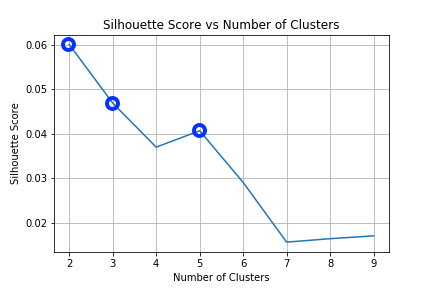

### README File for User Clustering.

#### How Clustering Was Performed:

1. Data:
 
| UserID | Ingredient 1 Freq | Ingredient 2 Freq | ... | Ingredient N Freq |
|--------|-------------------|-------------------|-----|-------------------|
| 1      | .2                | .8                |     | .35               |
| 2      | .5                | .3                |     | .6                |

  - Ingredient Frequency Definition:
    - Number of Times Ingredient is Present in Ordered Meals / Total Number of Ordered Meals
    
2. Models:
  1. Kmeans
  2. Hierarchical Cluster
  
#### First Run Insight:
Because there are 1400+ unique ingredients many ingredients that are very similar are counted as seperate and skew the clustering to favor various forms of spices and vegetables as the most important feature for all clusters. To fix this I manually went through the 900 top ingredients and mapped them to 89 unique ingredient categories. This helped several aspects of the clustering:
  1. Greatly lowered the dimensionality and allows for much faster computation time on generating the clusters.
  2. Key ingredients in dish (or the ingredient that make up the bulk of the dish), for example chicken, fish, avocado, pasta, are actually the most important features in each cluster.
  3. Categories allow for much more meaningful insight into what each cluster prefers. The extremely specific ingredients are hard to gain meaning from.
  
#### Second Run Results (With Ingredient Categories):
With ingredient categories Kmeans clustering cann identify some clear user groups. The below silhouette score plot shows how well seperated different cluster sizes are.

Based on this plot and inspection of clusters, 3 and 5 are the most insightful numbers.

#### Most Important Ingredient Inspection:
From Kmeans clustering with 3 clusters we get these distinct user groups and their 15 most important ingredients (0 is most important and so on)

| Importance | Cluster 1 | Cluster 2 | Cluster 3|
|------------|-----------|-----------|----------|
|0				|spicy sauce|veg		|butter|
|1				|noodles	|tofu		|egg|
|2				|rice		|avocado	|beef|
|3				|sour		|falafel 	|pork|
|4				|noodles 	|grain		|mayo|
|5				|salmon		|dressing 	|dairy|
|6				|salad		|peas		|flour|
|7				|soy		|sour sauce	|potatoes|
|8				|duck 		|seeds		|chicken|
|9				|octopus	|sweet sauce|alc|
|10				|chili 		|df milk	|ketchup|
|11				|turkey		|savory sauce|lamb|
|12				|nut		|pepper		|sugar|
|13				|seed		|vegan chocolate|oil|
|14				|paste		|fruit		|corn|

