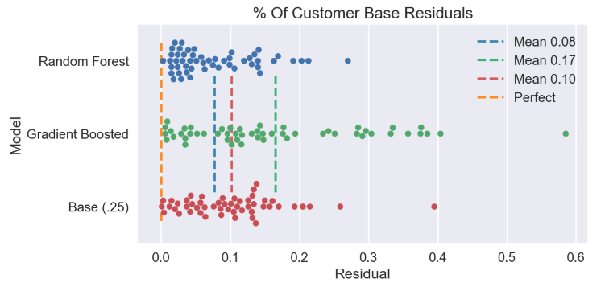

### Description of Order Prediction Model and Function

#### Background
This part of the project allows Smunch to predict the "successfulness" of dish. Because Smunch's meal setup is offerering either 4 or 8 meals a day to each company, it would be very hard to create a general "successfulness" metric on a standalone meal. The goal here is predict the "successfulness" of a meal compared to the other meals offered. More concretely we define our target to be:

	- "Successfulness" = Percent of customer who order the dish / Number of total customers who ordered

The model built in this folder predicts this value based on the ingredient preferences of each user.

#### Data
Because every person has very unique ingredient/dietary preferences a single model for everyone would not perform well. The following breaks down the data used to create the model for each user.

Table for User 1:

| MealID | Ingredient 1 | Ingredient 2 | ... | Ingredient N | Consistency Score |
|--------|--------------|--------------|-----|--------------|-------------------|
| 1      |      1       |       0      |     |       1      |        4/10       |
| 2      |      0       |       1      |     |       1      |        2/7        |
| 3      |      1       |       1      |     |       0      |        9/11       |

	- Consistency Score = # of times a meal has been ordered / # of times meal has been offered
	- Ingredients are 0, 1 depending on if the ingredient is absent or present in the meal.

Each user has their own table that is used to build their model. Once all models are built new meals can be fed into the model and a Consistency Score will be predicted for each. For example, assume we are comparing four meals to one another and only using 4 customers.

| User |Meal1 C-Score | Meal2 C-Score | Meal3 C-Score| Meal4 C-Score| Choice |
|------|--------------|---------------|--------------|--------------|--------|
|   1  |   0.074      |     0.185     |     0.426    |     0.315    |  Meal3 |
|   2  |   0.241      |     0.167     |     0.352    |     0.241    |  Meal3 |
|   3  |   0.222      |     0.420     |     0.080    |     0.278    |  Meal2 |
|   4  |   0.389      |     0.167     |     0.333    |     0.111    |  Meal1 |
   
   	
- The choice is meal with highest C-Score

Our Final Prediction is:
- 25% of customer base will order Meal1
- 25% of customer base will order Meal2
- 50% of customer base will order Meal3
- 0% of customer base will order Meal4

#### Model
The final model used for this prediction is a Random Forest Regressor. It performance is 20% superior to the baseline guess of equal % of customer base for every offered meal. More specifically, on average the Random Forest customer % prediction is +-8%. The below chart shows a comparison of a Random Forest, Gradient Boost, and the Baseline.

- This plot shows the residuals of each model.
- Ideally the residuals would be 0 (orange vertical line)

